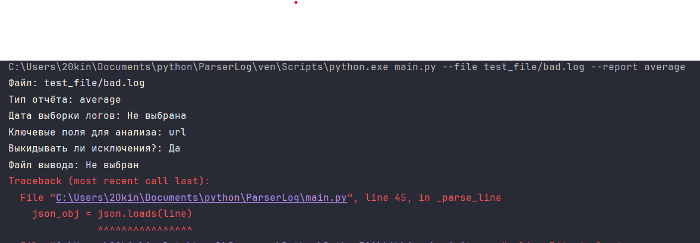

Доброго дня, Workmate.

У вас было самое интересное задание. 
Ограничений конкретных нет, просто файл, просто вывод.
Прояви фантазию и логику.

Изначально было проще реализовать систему обработки логов для любых ключевых полей.
Не обкладывал все переменные классов проверками, т.к. данные используются в рамках одного файла и не будут использованы в других местах. Но не смотря на это, некоторые переменные и методы написаны в стиле protected.

Фичи:
- date имеет гибкую систему ввода
- force позволяет не реагировать на ошибки, ошибочные данные не будут учтены
- keywords со старта позволит использовать множество ключевых слов
- output вывод в файл тоже имеется

Обычный запуск без доп. модификаций

python.exe main.py --file test_file/example1.log test_file/example2.log --report average 

Передано 2 ключевых слова

python.exe main.py --file test_file/example1.log --report average --keywords url status 

Передано 2 ключевых слова, фильтрация по дате + модификатор force

python.exe main.py --file test_file/example1.log test_file/example2.log --report average --date 2025-06-22 --keywords url status --force

Передача сломанного JSON

python.exe main.py --file test_file/bad.log --report average 

python.exe main.py --file test_file/bad.log --report average --force 

Покрытие тестами:

